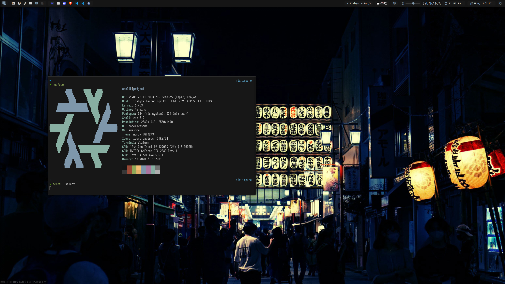

<h1 align="center">ocelik94/awesomewm-dotfiles</h1>

  

    
  

 

# 🗒 About
These are the configurations I use to set up my `awesomewm` installation. You are welcome to grab anything that interests you.

Those configurations are nearly identical to [sachnr/awesomewm-dotfiles](https://github.com/sachnr/awesomewm-dotfiles). A special thank you to Sachnr.

# 💾 Resources

There are several other configurations from which I learned and copied, in no particular order:

- [sachnr/awesomewm-dotfiles](https://github.com/sachnr/awesomewm-dotfiles)
